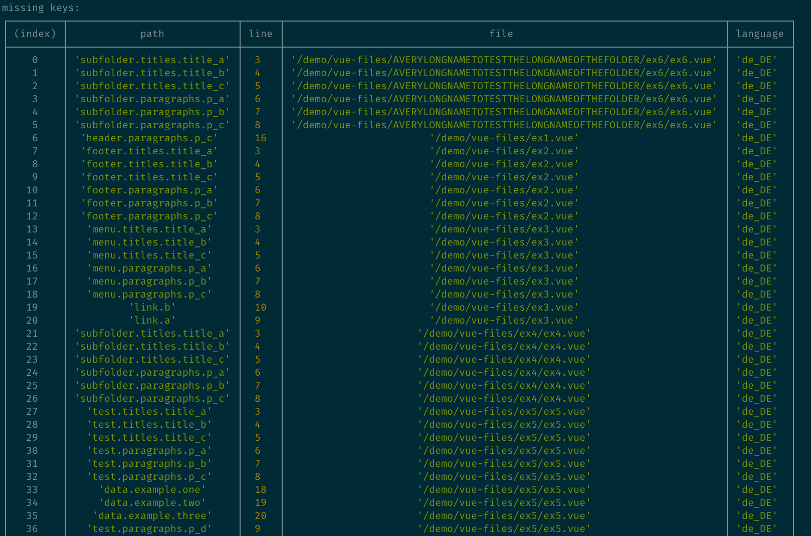

<h1 align="center">
  <a href="https://github.com/pixari/vue-i18n-extract"></a>
</h1>

<p align="center">
  <a href="https://www.npmjs.com/package/vue-i18n-extract"></a>
  <a href="https://www.npmjs.com/package/vue-i18n-extract"></a>
  <a href="https://snyk.io/test/github/pixari/vue-i18n-extract?targetFile=package.json"></a>
  <a href="https://codeclimate.com/github/pixari/vue-i18n-extract/maintainability"></a>
  
</p>

`vue-i18n-extract` is built to work with your Vue.js projects using the library [vue-i18n](https://kazupon.github.io/vue-i18n/). It runs static analysis on your Vue.js source code looking for any `vue-i18n` usage, in order to:

- Report all **missing keys** in your language files.
- Report all **unused keys** in your language files.
- Optionally write every missing key into your language files.

<p align="center">
  
</p>

# Usage

You can run `vue-i18n-extract` with npx
```sh
npx vue-i18n-extract report --vueFiles './path/to/your/vue-files/**/*.?(js|vue)' --languageFiles './path/to/your/language-files/*.?(json|yml|yaml)'
```

**Or** you can download into your project and run as an `package.json` script.
```sh
npm install --save-dev vue-i18n-extract
```

Add the following section to your `package.json`:
```json
{
  "scripts": {
    "vue-i18n-extract": "vue-i18n-extract report --vueFiles './path/to/your/vue-files/**/*.?(js|vue)' --languageFiles './path/to/your/language-files/*.?(json|yml|yaml|js)'"
  }
}
```

Finally, run:

```sh
npm run vue-i18n-extract
```

This will print out a table of missing keys in your language files, as well as unused keys in your language files.

# Config

```js
--vueFiles (required)
// String as Glob pattern
// Example: ./path/to/your/vue-files/**/*.?(js|vue)
// The Vue.js file(s) you want to extract i18n strings from. It can be a path to a folder or to a file. It accepts glob patterns.

--languageFiles (required)
// String as Glob pattern
// Example: ./path/to/your/language-files/*.?(json|yml|yaml)
// The language file(s) you want to compare your Vue.js file(s) to. It can be a path to a folder or to a file. It accepts glob patterns.

--output
// String
// Example: output.json
// File path to output the result of the report

--add
// Boolean
// Use if you want to add missing keys into your language files.

--remove
// Boolean
// Use if you want to remove unused keys from your language files.

--ci
// Boolean
// The process will exit with exitCode=1 if at least one translation key is missing or unused (useful if it is part of a CI pipeline).

--separator
// String
// Use if you want to override the separator used when parsing locale identifiers. Default is `.`.

--exclude
// String
// Use if you want to exclude keys from the unused keys report. If the value is a node, all it's children will be excluded. Can be used multiple times to exclude multiple keys and nodes.
// Example1 (specific, value is a key): user.auth.username.label
// Example2 (nested, value is a node): user.auth
// Example3 (multiple): --exclude user.auth.username.label --exclude user.auth.password.label

--noEmptyTranslation
// String
// Use if you want to generate a default translated string by using the key itself
// Example 1: '' => DO NOT generate default strings (default)
// Example 2: '*' => generate default string for ALL locales
// Example 3: 'en' => generate default strings ONLY for en locale
```

## Config File

Optionally you can add a `vue-i18n-extract.config.js` file to the root of your project. Run `npx vue-i18n-extract init` to quickly bootstrap a config file. Available configuration is found [here](src/config-file/vue-i18n-extract.config.ts). Once you have a config file you can then just run `npx vue-i18n-extract`

# Supported `vue-i18n` Formats

- Static in template or script:
```js
// Single or double quote, and template literals
$t('key.static') $t("key.static") $t(`key.static`)

// Without dollar sign
t('key.static') t("key.static") t(`key.static`)

// $tc Support for use with plurals
$tc('key.static', 0) $tc("key.static", 1) $tc(`key.static`, 2)

// Without dollar sign
tc('key.static', 0) tc("key.static", 1) tc(`key.static`, 2)
```

- i18n component:
```html
<i18n path="key.component"></i18n>
<i18n-t keypath="key.component"></i18n-t>
<Translate keypath="key.component"></Translate>
```

> Note: As of right now there is no support for binding in a path like `:path="condition ? 'string1' : 'string2'"` there is just support for strings as shown above.

- i18n component in code:
```js
const TranslationComponentInCode = h(Translation, {
  keypath: 'Translation component in code.',
  tag: 'p',
});
```

- v-t directive with string literal:
```html
<p v-t="'key.directive'"></p>
<p v-t.preserve="'key.directive'"></p>
```
> Note: As of right now there is no object support to reference a path from component data.

# Usage in NodeJS
Make sure you have `vue-i18n-extract` installed locally and import the library.

```js
const VueI18NExtract = require('vue-i18n-extract');

const report = VueI18NExtract.createI18NReport({
  vueFiles: './path/to/vue-files/**/*.?(js|vue)',
  languageFiles: './path/to/language-files/*.?(json|yml|yaml|js)',
});
```

# Why?

Setting up a Vue.js app with internationalization (i18n) support is easy nowadays: Once you have installed the plugin and injected into the Vue instance, you can just put `$t(‘Hello World’)` inside Vue.js component templates to use the plugin.
However, in our personal experience we found it very difficult to keep the language files and the `.vue` files in sync.

That's why we wrote `vue-i18n-extract`. We needed a way to analyze and compare our language files to our Vue.js source files, then report the result in a useful way.
# Contribution

Please make sure to read the [Contributing Guide](.github/CONTRIBUTING.md) before making a pull request.

# License

[MIT](http://opensource.org/licenses/MIT)

<h2>Core Team</h2>

<table>
  <tbody>
    <tr>
      <td align="center" valign="top">
        
        <br>
        <a href="https://github.com/Spittal">Jamie Spittal</a>
      </td>
      <td align="center" valign="top">
        
        <br>
        <a href="https://github.com/Pixari">Raffaele Pizzari</a>
      </td>
     </tr>
  </tbody>
</table>
