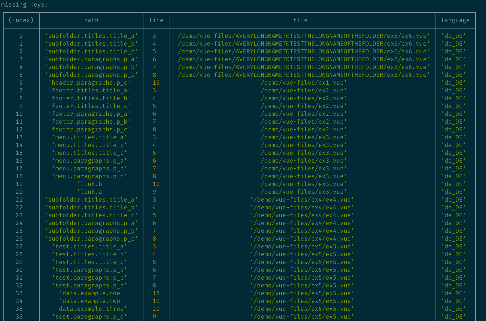

<h1 align="center">
  <br>
  <a href="https://github.com/pixari/vue-i18n-extract"></a>
</h1>

<h4 align="center">Analyse all the <a href="https://kazupon.github.io/vue-i18n/" target="_blank">vue-i18n</a> language files and placeholders of your project</a>.</h4>

<p align="center">
  <a href="https://www.npmjs.com/package/vue-i18n-extract"></a>
  <a href="https://www.npmjs.com/package/vue-i18n-extract"></a>
  <a href="https://snyk.io/test/github/pixari/vue-i18n-extract?targetFile=package.json"></a>
  <a href="https://codeclimate.com/github/pixari/vue-i18n-extract/maintainability"></a>
  
</p>

<p align="center">
  
</p>

## :green_book: Table of Contents

1. [Installation](#installation)
2. [Introduction](#introduction)
3. [How to use it?](#how-to-use-it?)
4. [Contribution](#contribution)
5. [Core Team](#core-team)
6. [License](#license)

<h2>Installation</h2>

Install with yarn:

```bash
yarn add vue-i18n-extract --dev
```

Install with npm:

```bash
npm install --save-dev vue-i18n-extract
```

<h2>Introduction</h2>
<a href="https://kazupon.github.io/vue-i18n/" target="_blank">Vue I18n</a>  is a plugin for Vue.js which makes the internationalization and localization very easy.

However, managing and maintaining all the language files and the vue-i18n keys inside a project could be very demanding and **vue-i18n-extract solves this problem**.

Vue-i18n-extract performs a static analysis on a Vue.js project (which uses vue-i18n) and reports the following information:

- list of all the **unused vue-i18n keys** (entries found in the language files but not used in the project)
- list of all the **missing keys** (entries found in the project but not in the language files)

Optionally you can decide to show the output in the console or in a json file.

The missing keys can also be automatically added to the given language files.

<h2>How to use it?</h2>

<h3> Without config </h3>

```bash
yarn run vue-i18n-extract report -v <vueFiles> -l --languageFiles <languageFiles>
```

or

```bash
npm run vue-i18n-extract report -v <vueFiles> -l --languageFiles <languageFiles>
```

Required options

```
-v, --vueFiles <vueFiles>,
The Vue.js file(s) you want to extract i18n strings from. It can be a path to a folder or to a file. It accepts glob patterns. (ex. *, ?, (pattern|pattern|pattern)

-l, --languageFiles <languageFiles>,
The language file(s) you want to compare your Vue.js file(s) to. It can be a path to a folder or to a file. It accepts glob patterns (ex. *, ?, (pattern|pattern|pattern)

```

Options

```
-o, --output <output>
Use if you want to create a json file out of your report. (ex. -o output.json)

-a, --add,
Use if you want to add missing keys into your json language files.,

-d, --dynamic,
Use if you want to ignore dynamic keys false-positive. Use it 2 times to get dynamic keys report.',

-ci,
The process will exit with exitCode=1 if at least one translation-key is missing (useful especially if it is part of a CI pipeline).',
```

Examples

```
npm run vue-i18n-extract report -v './demo/vue-files/**/*.?(js|vue)' -l './demo/lang/**/*.?(json|yaml|yml)'
```

<h3>With Config</h3>


<h3>With config file</h3>

Create an empty config file:

```bash
yarn run vue-i18n-extract init
```

Open the config file:

```bash
vue-i18n-extract.config.js
```

Edit the file and change the values:

```js
module.exports = {
  vueFilesPath: './', // The Vue.js file(s) you want to extract i18n strings from. It can be a path to a folder or to a file. It accepts glob patterns. (ex. *, ?, (pattern|pattern|pattern)
  languageFilesPath: './', // The language file(s) you want to compare your Vue.js file(s) to. It can be a path to a folder or to a file. It accepts glob patterns (ex. *, ?, (pattern|pattern|pattern)
  options: {
    output: false, // false | string => Use if you want to create a json file out of your report. (ex. output.json)
    add: false, // false | true => Use if you want to add missing keys into your json language files.
    dynamic: false, // false | 'ignore' | 'report' => 'ignore' if you want to ignore dynamic keys false-positive. 'report' to get dynamic keys report.
  }
};
```

Run the program:
```bash
yarn run vue-i18n-extract use-config
```

<h2>Contribution</h2>

We are very happy to get any kind of contribution to this project and we would like to make contributions to this project as easy and transparent as possible.

When contributing to this repository, please first discuss the changes you wish to make via issue, email, or any other method with the owners of this repository before making a change.

Please note we do have a code of conduct, please follow it in all of your interactions with the project.

You can use the GitHub repository page for the following contributions:

- Reporting a bug
- Discussing the current state of the code
- Submitting a fix
- Proposing new features
- Becoming a maintainer

### We use [Github Flow](https://guides.github.com/introduction/flow/index.html), so all code changes happen through pull requests.

Pull requests are the best way to propose changes to the codebase. We actively welcome your pull requests.

**Instructions for contributing:**

1. Fork the repo and create your branch from `master`.
2. If you've added code that should be tested, add tests.
3. If you've changed APIs, update the documentation.
4. Ensure the test suite passes.
5. Make sure your code lints.
6. Issue that pull request!

<h3> Any contributions that you make will be under the MIT Software License </h3>
In short, when you submit the code changes, your submissions are understood to be under the same [MIT License](http://choosealicense.com/licenses/mit/) that covers the project. Feel free to contact the maintainers if that's a concern.

### :bug: Report bugs using Github's [issues](https://github.com/pixari/vue-i18n-extract/issues)

We use GitHub issues to track public bugs. Report a bug by [opening a new issue](https://github.com/pixari/vue-i18n-extract/issues/new).

Great Bug Reports tend to have:

- A quick summary and/or background
- Steps to reproduce
- What you expected would happen
- What actually happens

<h2>Core Team</h2>

<table>
  <tbody>
    <tr>
      <td align="center" valign="top">
        
        <br>
        <a href="https://github.com/Spittal">Jamie Spittal</a>
      </td>
      <td align="center" valign="top">
        
        <br>
        <a href="https://github.com/Pixari">Raffaele Pizzari</a>
      </td>
     </tr>
  </tbody>
</table>

<h2>License</h2>
By contributing, you agree that your contributions will be licensed under its [MIT](http://opensource.org/licenses/MIT) License.
